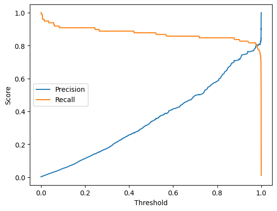
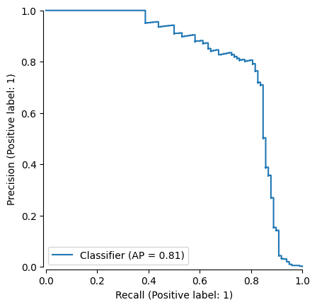
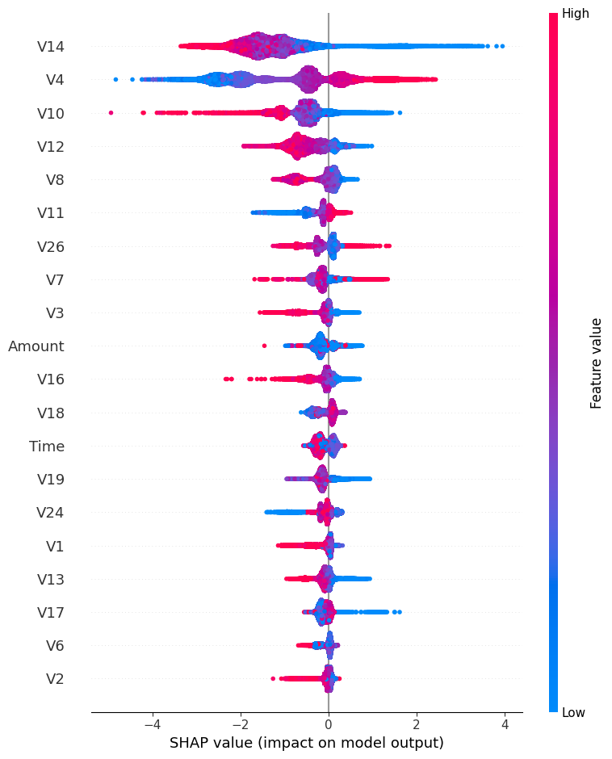

## Credit Card Fraud Detection
Training an XGBoost model to detect credit card fraud on a highly imbalanced (0.17% fraud) dataset comparison to logistic regression models, threshold optimisation and SHAP analysis & PR-AUC evaluation, with discussion on industry concerns.

## Overview

An XGBoost decision tree model was trained to detect fraudulent transactions. The model achieved a Precision Recall Area Under Curve of 0.806, with a 0.75 precision, comparable to detection rates in general in the banking sector. SHAP feature analysis found similar features of interest to the initial EDA.

## Problem Statement

In the UK around £1B is stolen through fraudulent transactions every year, and whilst £1.45B worth of unauthorised fraud is prevented before the transaction (~67p for every £1 attempted), all unauthorised payments deemed non-negligent legally must be refunded per UK law, amounting to ~98% of cases of unauthorised fraud being refunded. On the other hand only 59% of authorised fraud (where the victim is tricked into sending money) is refunded to victims. Online fraud is growing in sophistication and prevalence (per Interpol), creating a major challenge for the banking industry, and so fraud prevention methods also must continue to develop to protect consumers and the integrity of the banking sector. There were around 2.3 billion debit card transactions in the UK in March of 2026, which if reviewed for fraud manually at a rate of 1/second would take 73 years, hence ML algorithms are essential in fraud prevention in the 21st century.

It's important to consumers that legitimate payments are processed promptly, in fact customer experience is a top concern among reasons for switching bank provider according to Which. It's also a major concern for business, with fraud filter errors costing $13 for every $1 lost due to fraud, at around $440B a year globally, annually. It is therefore critical to any bank that customers are not bothered with falsely flagged fraud alerts; we need to be precise. The issue is that since fraud is so rare compared to legitimate transactions, if our algorithm is 50% precise, we will flag maybe 100 transactions a year for a customer, when it's likely none of them are fraudulent.

There is the simultaneous concern of detection efficacy, termed recall. Even though checks might be financially encumbering for business, not checking for fraud allows it to become a viable financial opportunity for criminal organisations, who can and do already steal from customers, costing either the customer or the bank money.

We conclude that even though banks must adopt a minimally frictional approach to processing transactions, making precision paramount, as many fraudulent transactions as possible must be interrupted in order to protect banks and customers, and prosecute where possible, meaning recall must stay high. Our aim will be to create a model that maximises precision and recall in order to meet these industry requirements.

*£1 billion stolen, £1.45 billion prevented (2025) https://www.ukfinance.org.uk/news-and-insight/press-release/fraud-report-2025-press-release* \
*Fraud is growing globally and becoming more sophisticated (2026) https://www.interpol.int/en/News-and-Events/News/2026/INTERPOL-report-warns-of-increasingly-sophisticated-global-financial-fraud-threat*\
*~59% of authorised payment fraud total value returned (2024) https://www.ukfinance.org.uk/policy-and-guidance/reports-and-publications/annual-fraud-report-2025*\
*2.3 billion debit card transactions in March (2026) https://www.ukfinance.org.uk/data-and-research/data/card-spending*\
*Consumers rate customer experience highly in banking https://www.which.co.uk/money/banking/bank-accounts/best-bank-accounts/best-and-worst-banks-a8VTn0B0PJNC*\
*The cost of fraud filtering (2026) https://paymid.com/true-cost-false-declines-recovering-revenue* 

## Data

The dataset is ~284k real world transactions over the course of 2 days made in Europe in 2013, with PCA-anonymised features, transaction value, and time. The prevalence rate of fraudulent transactions in the dataset is 0.17%.

Dataset link: www.kaggle.com/datasets/mlg-ulb/creditcardfraud/data

## Approach

Exploratory data analysis: The csv was loaded into pandas, where the data types, the frame shape, and nulls were checked. The data was clean, and all values were float64, except for the classifier for fraud or not which was a binary int64 0 or 1. The dataframe otherwise consists of 28 anonymised V1-v28 features, the time of the transaction since 0, and the amount.

Then, histograms were produced to evaluate any correlations between fraud and time, amount, then any of the anonymised variables. For this step, amount was taken as a log value, and contributions from fraud and legitimate counts were equalised to account for weighting imbalance. We note observations from the EDA.

Logistic Regression Models: Train test split was produced from the dataframe. Data is Standard Scaled on the training data to prevent larger valued features dominating. The model was used to produce results in the form of a confusion matrix, classification report, average precision score, and receiver operating characteristic score. The model was modified with class weighting balanced, applying a numeric advantage to learning from fraud cases, to account for the relative differential in prevalence. The results of this second model were recorded.

XGBoost: The data is split into train test split, and values chosen for an xgboost.XGBClassifier model. The model is fitted to the training data, predictions made against test data for the class, and probability recorded. Again, we recorded results.

Threshold tuning: Precision and Recall were plotted against threshold, and an acceptable threshold value selected. We then ran our predictions through again with the new threshold, to compare precision and recall.

Overfitting test: The precision improved to a large degree whilst sacrificing a small amount of recall. To investigate overfitting, the model was also run on the training data to compare against its results from the test data. A less aggressive model was instantiated and run, its output analysed. Ultimately, the 2nd attempt at an XGBoost model using less aggressive learning and less depth had the same gap in test vs train PR-AUC and so was rejected as inferior to the prior model due to having equal distance between train and test PR-AUC, indicating that overfitting was not the major factor.

SHAP Analysis: Analysis of a SHAP summary plot of the model deemed best, leading to final analysis of the data and discussion of the XGBoost model

## Results

| Model | PR-AUC | ROC-AUC |
|-------|--------|---------|
| Logistic regression (unweighted) | 0.741 | 0.961 |
| Logistic regression (balanced) | 0.719 | 0.972 |
| XGBoost | 0.806 | 0.978 |

## Key Findings

1. PR-AUC is useful to differentiate model success: The XGBoost model has the highest PR-AUC (precision recall area under curve) score, which accounts for accuracy of positive predictions as well as success in identifying all positive cases in a dataset. This is the critical measure, since the dataset is so heavily skewed towards one class, with only ~0.17% of the dataset containing fraud cases. ROC-AUC turns out to not be a useful measure for comparing models of this dataset, since the false positive rate is necessarily dominated by the true negatives, i.e. there were ~2x the number of false positives as true positives for the XGBoost model, and yet ROC-AUC is ~0.97. ROC-AUC shows the ability of the models to discriminate, but is not a measure of success for this problem.

2. The class weighting moves the operating point, did not improve ranking: Without a balanced weighting term in the gradient, the precision for true positive is higher, but recall is much lower. Both Logistic regression models had similar PR-AUC scores, so comparing the confusion matrices we see the unbalanced model underidentifies, missing 1/3rd of the fraud cases, but is false positive on only 8 transactions, whilst the balanced model catches ~88% of fraud, but is false positive on >1000 records. With similar PR-AUC scores, we see that applying a weighting to the classes is approximating the behaviour of changing the threshold for classification, not adding the ability to further discriminate, hence it is seen that linear models do not capture the complexity of the data.

3. XGBoost practical ceiling: Precision of ~0.75 was the highest that the model could achieve before collapsing recall. This is a limit of the model, but it is worth noting that the dataset also has limits, and perfectly predicting fraud cases from the available features may not be possible. This was investigated through trying to mitigate overfitting, and by trying to increase the model's recall through more aggressive learning. The Precision-Recall curve for the XGBoost model having an area of 0.81, while showing success in detection, shows the pragmatic limits starkly; optimising for precision alone allows only a 40% detection rate (fraud would be rife if a bank relied on this model), and optimising for recall means that at *only* 90% detection, we'd have 10 false positive detections for every genuine one (investigation teams relying on this model would be swamped with potentially hundreds of thousands of cases, mostly false)

*AP rounded to 0.81 from 0.806

4. Observations in the data are critical in understanding a dataset with such a small positive set: While the XGBoost model was arguably successful in its construction, there are certain things which simply are not apparent without understanding the data visually; for example, the fraud values do not cluster in the same way as legitimate transactions did, since selections of values by humans do not create a normal distribution, as has been seen historically with financial fraud. Without engineering models to account for trends like this, they may not even learn them in the first place, and with such a small dataset this would be quite challenging anyway.

## Interpretability

SHapley summary_plot applied to the XGBoost model found V14, V4, V10, V12, and V8 to contribute most to the model's weights. In the initial exploratory analysis, V4, V11, V12, V14, V17 were noted in particular to seem distinctive for fraud cases. 3/5 visually distinctive features were identified by the model, and a 4th was in the top 6, with only V17 not being preferred by the model for weighting. For such a relatively small positive set to train on, the EDA cannot be rejected as human bias and is worth considering along with the model's learned patterns.

## Limitations

After the 3 models that were considered were trained and compared, and a threshold selected, overfitting potential was identified by the massive gain in precision for little cost to recall. Comparison of the model precision on train vs. test sets suggested mild overfitting, and so 1 level of tree depth was removed, and the learning rate was halved. The result was a reduction in PR-AUC for both train and test sets through the less aggressive model and so the gap was not closed; there was no increase in generalisation, and so reducing the model's complexity and learning rate did not lead to a more generalised model, but did point out the limitations of the dataset.

The anonymised features remove dimensions of interpretability that may have otherwise been present in the data, thus engineering the model to understand those real world factors is not possible.

In terms of application to modern fraud identification in debit cards, it is possible that any useful model based on this data is outmoded, since contactless payments and novel fraud techniques have both risen since 2013.

## Repository Structure

`fraud_detection.ipynb` - analysis notebook\
`README.md` - current file\
`requirements.txt` - notebook dependencies\
`images/` - exported plots from notebook\

## How to Run

1. Save the csv file used in this project to any location
2. Copy the path into the "path" variable in the setup stage
3. Run all cells

Notes:
All packages referenced in setup should be imported, all referenced in requirements.txt\
Python 3.11 \
PNG outputs require an /images folder in the same directory as the notebook. Images are provided as evidence to the investigation, but files will be replaced on running the notebook\
Notebook is not designed to be run out of order, run in order to avoid confounded variables.
